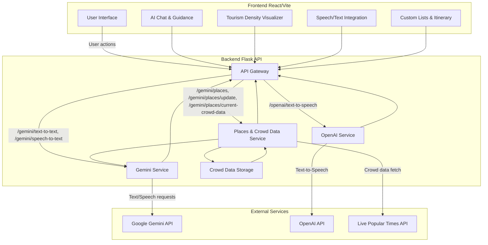

# Architecture Diagram: Crowd Control - Tourism Density Mapper

---

**Description:**
- The **Frontend** (React, Vite, shadcn/ui) provides the user interface, chat, visualizations, and speech/text features.
- The **Backend** (Flask API) acts as an API gateway, routing requests to Gemini, OpenAI, and the Places/Crowd Data service.
- **Gemini Service** handles AI chat and speech-to-text via Google Gemini API.
- **OpenAI Service** handles text-to-speech via OpenAI API.
- **Places & Crowd Data Service** manages place extraction, crowd data retrieval (from Live Popular Times API), and stores results in `test.json`.
- Data flows between frontend, backend, AI services, and external APIs as shown above.
