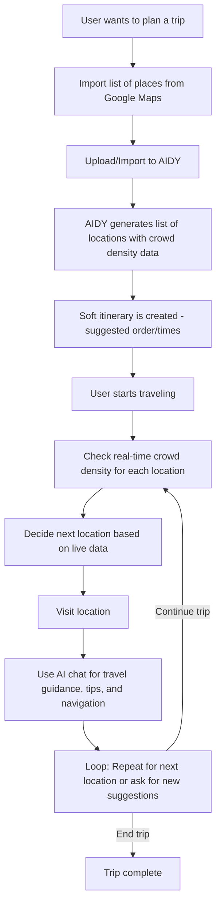

# Process Flow Diagram: AIDY - Crowd Control App

---

**Additional Notes:**
- The user can interact with the AI chat at any stage for recommendations, navigation, or local tips.
- The itinerary is flexible and adapts to real-time crowd data, helping users avoid crowded places and optimize their experience.
- The process supports both pre-trip planning and on-the-go decision making.
